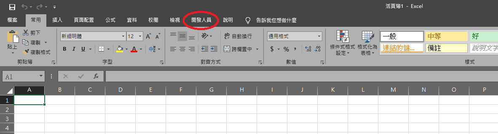

# Excel VBA筆記

2020年突然被叫去管倉庫，隨著資料量越來越多，傳統的函數已經漸漸無法負荷每天要處理的資料量。於是興起了研究VBA的念頭，想要透過程式讓我的工作變得更輕鬆

後來確實因為VBA幫我省下許多時間，不過那些功能到底能不能透握函數實現，我也沒追根究底了，也許只是我不會用函數，但VBA的操作相對於函數來說對我比較好上手，最後希望這份筆記可以幫助到想要減少工作時間的你

# 環境設置

Excel在安裝好後不會預設開啟開發人員選項，因此第一件要做的事就是將開發人員選項打開

- 示意圖

 

接下來跟著我的步驟做吧！

    1.從「檔案」那邊打開選單
    2.選擇「選項」，將小視窗打開
    3.選擇「自訂功能區」
    4.將「開發人員打勾」
    5.按下確定，然後就會發現「開發人員」的工作區出現了

* 「檔案」在什麼地方

- 「選項」的位置

- 調整「自訂功能區」

步驟可參考youtube影片

<iframe width="480" height="270" src="https://www.youtube-nocookie.com/embed/Koe_JvnvAcY" frameborder="0" allow="accelerometer; autoplay; clipboard-write; encrypted-media; gyroscope; picture-in-picture" allowfullscreen></iframe>

既然大家都開啟「開發人員」了，那就要繼續往下囉
