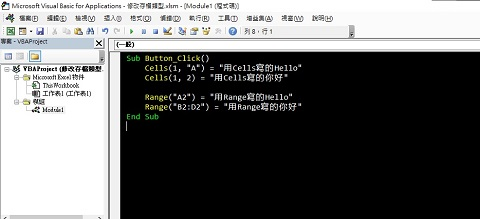

# Excel VBA筆記

2020年突然被叫去管倉庫，隨著資料量越來越多，函數組成的公式已經漸漸無法負荷每天要處理的資料(~~也可能是我不會用~~)。於是興起了研究VBA的念頭，想要透過程式讓我的工作變得更輕鬆省時

後來確實因為VBA幫我省下許多時間，不過那些功能到底能不能透過函數實現，我也沒追根究底了，也許只是我不會用函數，但VBA的操作相對於函數來說對我比較好上手

後來時常有朋友、同學或同事跟我請教Excel的問題，當初也有答應同事做一些教學影片，~~但是我後來一直很懶~~，又突然發現一段時間沒用VBA後也開始忘記了，索性整理一下操作與筆記，好讓自己以後要用到時有個參考，最後希望這份筆記可以幫助到想要減少工作時間並且在看這頁的你

※小提醒：我用的版本是2016(~~換成2019版本了我還是還沒把這篇寫完~~)，所以按鈕或是功能的位置也許會有一些差異，在操作時需要留意


---

# 01-環境設置

Excel在安裝好後不會預設開啟「開發人員」選項，因此第一件要做的事就是將開發人員選項打開

- 示意圖


<br/>

接下來跟著我的步驟做吧！

    1.從「檔案」那邊打開選單
    2.選擇「選項」，將小視窗打開
    3.選擇「自訂功能區」
    4.將「開發人員打勾」
    5.按下確定，然後就會發現「開發人員」的工作區出現了


* 「檔案」在什麼地方


- 「選項」的位置


- 調整「自訂功能區」


<br/>

步驟可參考youtube影片

<iframe width="100%" src="https://www.youtube-nocookie.com/embed/Koe_JvnvAcY" frameborder="0" allow="accelerometer; autoplay; clipboard-write; encrypted-media; gyroscope; picture-in-picture" allowfullscreen></iframe>

<br/>

既然大家都是「開發人員」了，那電梯就要繼續往下囉

---

# 02-巨集

巨集（Macro），是一種批量處理的稱謂。

暗示著將小命令或動作轉化為一系列指令，也就是使用者執行一系列操作，並且讓程式來「記住」這些操作以及順序。更進階的使用者可以通過內建的巨集程式設計來直接使用那些應用程式的功能

[維基百科－巨集](https://reurl.cc/KxMrGR)

.

所以巨集到底是什麼？能吃嗎？

如果是有在玩遊戲的人，應該對這個詞不陌生。
但總是聽著別人在巨集、巨集的說著，卻又似懂非懂

那巨集究竟是什麼？
可以怎麼幫助我們？

簡單講，巨集就是你可以錄好一些動作，然後讓電腦一直重複幫你做這些動作

例如在office軟體的word中，要把標題一的字體改成Consolas、字型大小改成20

這個動作看似簡單，實則不然。當只需要改5個、10個時，似乎自己勤勞點改一下就可以了，若是有5份都要改5個、10個呢？或是10份、20份、甚至是公司從古至今的檔案都要改呢？這時巨集的價值就出現了，它可以幫助你處理繁瑣且重複的工作，而且電腦的優點就是速度快、不會出錯

把事情丟給電腦，自己去泡一杯咖啡、突襲一下零食櫃，輕輕鬆鬆就把工作做好了


---

# 03-基本操作

Excel中使用VBA的目的，無非是想透過程式的協助，幫忙我們快速的把輸入的資料計算好，再填到我們要的格子內，因此與我們最相關的便是儲存格

## 031-建立巨集功能

終於到了實際操作VBA了，首先要先開啟Visual Basic的視窗才能夠繼續

打開Visual Basic的方式有兩種

    1.透過鍵盤快捷鍵Alt+F11的組合打開
    2.透過在功能區裡的「開發人員」中的「Visual Basic」按鈕打開

<br/>

- 鍵盤快捷鍵Alt+F11的位置


- 功能區「Visual Basic」按鈕位置


- Visual Basic視窗


<br/>

打開Visual Basic視窗後就能新增模組，這個模組內就能敘述我們各種巨集（函數）要執行的動作

在工作表（視你的Excel表單的名稱而定）中點擊右鍵打開選單，並在「插入」中加入「模組」

- 插入模組


插入模組後便能看到模組的畫面

- 新增成功


### 0311-存檔

到目前為止已經新增好模組，準備開始使用巨集了

不過如果一不小心玩壞了可就糟糕了，因此現在來到最重要的步驟之一－存檔

一般Excel的檔案格式是「Excel 活頁簿」副檔名是「.xls」或「.xlsx」，但在這種檔案內是無法使用巨集的，因此在存檔時必須將檔案類型改為「Excel 啟用巨集的活頁簿(*.xlsm)」

接下來再照著步驟走吧

    1.回到Excel中，點擊在功能區中的「檔案」
    2.找到「另存新檔」
    3.選擇存檔路徑（可由「瀏覽」的選項中更快挑選到要存檔的路徑）
    4.將「存檔類型」修改為「Excel 啟用巨集的活頁簿(*.xlsm)」並輸入檔名後存檔

- 存檔類型


※在開啟帶有巨集的檔案時，預設不會一起將巨集打開（曾有透過巨集散播電腦病毒的案例）

[維基百科－巨集病毒](https://reurl.cc/5oMbrV)

[Microsoft-Support 巨集病毒](https://reurl.cc/mqlkLl)

因此，若是這個檔案的來源可以信任，可以手動啟用巨集內容

- 啟用巨集內容


<br/>

## 032-取得與修改儲存格資料

終於要正式來寫程式囉

### 0321-Excel表格的基本認識

Excel中使用VBA最主要的目的就是取得跟修改儲存格內的資料，所以就從這邊先開始吧

首先，讓我們先來認識一下Excel表格

Excel的表格有分為欄跟列，欄的編號是英文字母（A、B、C、D、...），列的編號是阿拉伯數字（1、2、3、4、....），儲存格則是由欄號與列號組合而成，由2碼組合對應1個儲存格

- 空白的Excel表格


### 0322-建立函數（function）

有了儲存格的概念後，我們才能在程式內更精準的知道要取得或寫入哪個儲存格。接著回到剛剛建好的模組吧，這個地方就是我們要寫程式的地方，但是現在還一片空白

我在這邊準備了一段程式碼，直接複製／貼上吧

```VB
Sub Button_Click()
    Cells(1,"A") = "用Cells寫的Hello"
    Cells(1,2) = "用Cells寫的你好"

    Range("A2") = "用Range寫的Hello"
    Range("B2:D2") = "用Range寫的你好"
End Sub
```

貼上後會變成這樣



<br/>

首先，先回到Excel表格的視窗，將功能區切換至「開發人員」，再由「插入」中選擇「按鈕」並在表格上以拖拉的方式新增一個按鈕，新增出「按鈕」的同時需要指定巨集，所以便將我們寫好的Button_Click()指定給它吧。接下來便能透過這個按鈕當作媒介，呼叫我們剛剛寫的程式了


## 033-巨集內使用公式

現在可以透過VBA快速的對儲存格給值，但如果要直接呼叫Excel內建的函數會發生一些問題。Excel函數中有大量的「雙引號」（"），在程式語言中，這被視為跳脫字元，因此電腦會對它做出錯誤的解讀。不過大家也不必擔心，只要在跳脫字元前面再加上一個雙引號（"），即可讓電腦忽略跳脫字元的解讀

[維基百科－跳脫字元](https://zh.wikipedia.org/wiki/%E8%BD%AC%E4%B9%89%E5%AD%97%E7%AC%A6)

---

# 04-程式的領域

---

# Others-其他資源

[Microsoft Docs－Office VBA的入門](https://docs.microsoft.com/zh-tw/office/vba/library-reference/concepts/getting-started-with-vba-in-office)

[Microsoft Docs－了解VBA語法](https://docs.microsoft.com/zh-tw/office/vba/language/concepts/getting-started/understanding-visual-basic-syntax)

[Microsoft Docs－Office VBA參考](https://docs.microsoft.com/zh-tw/office/vba/api/overview/)
